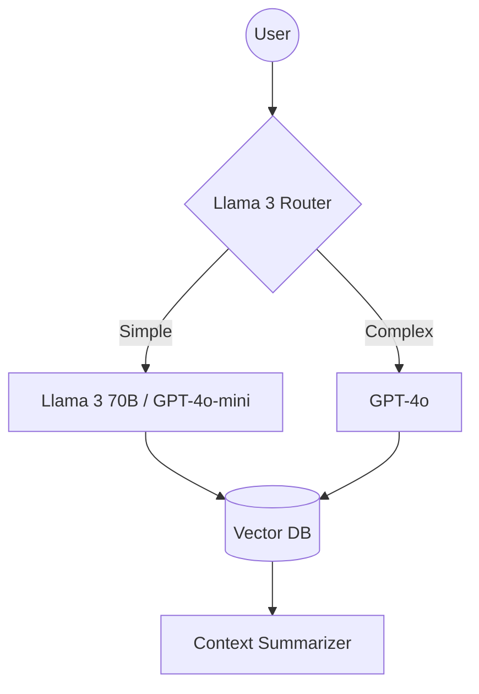

# 【交接賦能型】系統 Spec 專案包 - TechFlow Innovations

## 1. 工程資產模組 (Engineering Assets)

### Router Logic
The system implements an intent-based routing architecture to optimize for both precision and operational cost. By categorizing queries into specialized categories (Billing, Technical, General), the system ensures that high-reasoning models are only engaged when necessary.

```python
class TechFlowRouter:
    """Decision-tree router for intent-based model selection."""
    def route(self, query):
        query = query.lower()
        if "billing" in query or "price" in query:
            return "billing_specialist"
        elif "technical" in query or "bug" in query:
            return "technical_support"
        else:
            return "general_assistant"
```

### Prompt Strategy
*   **Model Provider Abstraction:** A `ModelProvider` class encapsulates API interactions, ensuring the system remains decoupled from specific vendors (OpenAI, Anthropic, or local inference).
*   **Tiered Model Selection:** 
    *   **Technical/Complex Queries:** Routed to GPT-4o for maximum reasoning capabilities.
    *   **Routine/General Queries:** Routed to GPT-4o-mini or local Llama 3 instances to minimize costs.

## 2. 架構藍圖模組 (Architecture Blueprint)

### System Architecture (Mermaid)


### Model Decoupling & Memory Plan
*   **RAG-Based Context Management:** Transition from linear context accumulation to a "Summary + Vector Memory" approach. Short-term memory is limited to the last 3 turns, while mid-term and long-term context are retrieved from a Vector DB (Chroma/Pinecone) as needed.
*   **Decoupled Inference:** The architecture supports hot-swapping providers, enabling the use of local inference for periodic summarization and routing tasks, reducing external API dependencies.

## 3. 團隊賦能指南 (Empowerment Guide)

### 5-Step Hallucination Detection Checklist
The following protocol must be applied to all critical AI outputs to ensure accuracy and mitigate risk:
1.  **Fact Anchor Check:** Verify if the response cites specific data from the established Vector DB/Knowledge Base.
2.  **Constraint Validation:** Audit the response against system prompt constraints (e.g., promotional exclusions).
3.  **Cross-Reference Logic:** Require the model to provide step-by-step reasoning for technical solutions to identify logic gaps.
4.  **Formatting Rigor:** Ensure JSON/Markdown outputs adhere strictly to the requested schema to prevent parsing errors.
5.  **Self-Correction Test:** Cross-verify critical factual outputs using a secondary model (e.g., GPT-4o output verified by Claude 3.5).

### Handover & Empowerment Plan
*   **Technical Translation (Days 1-3):** Workshop on prompt engineering (System vs. User) and collaborative configuration of the Router decision-tree.
*   **Red Team Exercise (Days 4-7):** Stress-testing the agent with edge cases to identify and document failure modes.
*   **Operational Handover (Days 8-10):** Final codebase review, documentation walkthrough, and establishment of budget guardrails.

## 4. 成本基線與分潤對照表

### Current Baseline (GPT-4o Only)
*   **Average Conversation:** 15 turns.
*   **Context Growth:** Linear.
*   **Token Waste:** Approximately 40% of tokens are consumed by redundant or low-value context.
*   **Estimated Cost:** $100 per 1,000 interactions.

### Projected Savings (Optimized Architecture)
| Strategy | Implementation | Saving Projection |
| :--- | :--- | :--- |
| **Model Tiering** | Offloading 60% of traffic to mini/local models | -15% |
| **Token Pruning (RAG) ** | Optimized context window management | -12% |
| **Total Projected Saving** | | **27%** |

*The projected 27% saving exceeds the client's 25% minimum quality gate, providing a robust baseline for the 30% profit-sharing agreement.*
